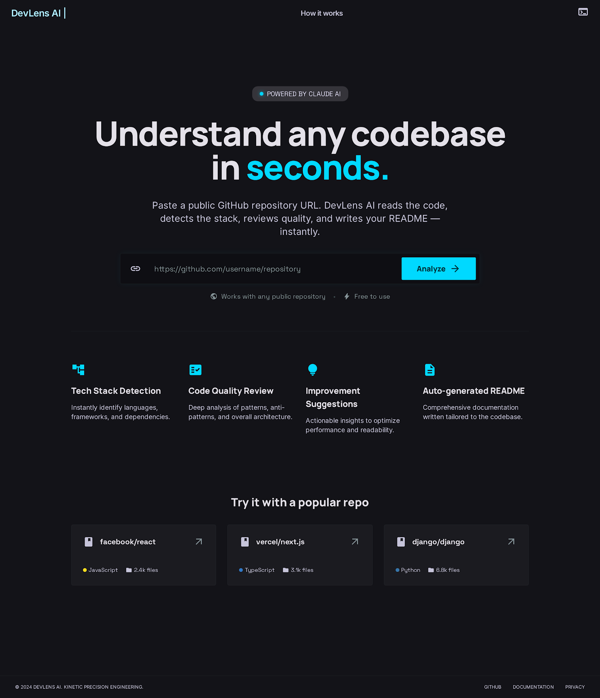
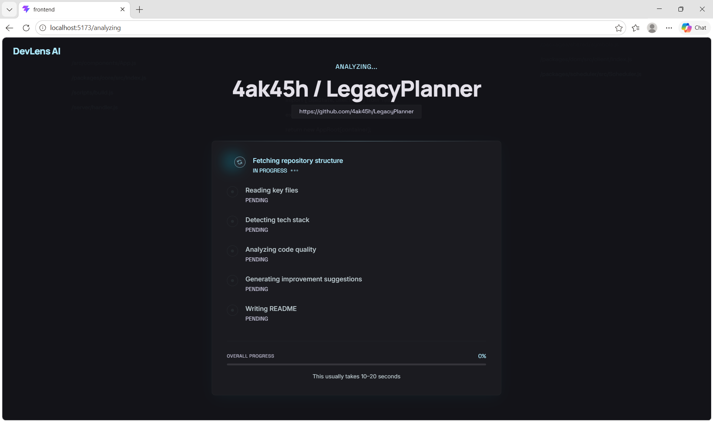
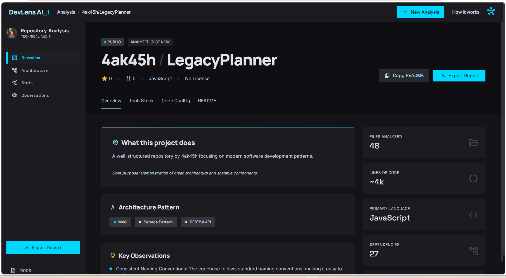

# DevLens AI

DevLens AI is a full-stack web application designed to analyze GitHub repositories and generate structured insights such as technology stack, architecture patterns, and code quality indicators.

It provides a complete pipeline from repository input to interactive visualization of analysis results through a clean and modular system design.

---

## 🔗 Repository

https://github.com/4ak45h/Devlens-ai

---

## 🚀 Key Features

* 🔍 GitHub Repository Analysis via URL input
* 🧠 Automated insight generation (summary, tech stack, architecture)
* 📊 Code quality evaluation with structured scoring
* 🏗️ Modular backend pipeline (route → service → analyzer)
* ⚙️ Clean API-driven architecture
* 🎨 Interactive frontend with loading and results view
* 📦 Separation of concerns (frontend / backend)

---

## 🧠 System Architecture

DevLens AI follows a layered architecture:

```text
Client (React UI)
        ↓
API Layer (Flask Routes)
        ↓
Service Layer (Processing Logic)
        ↓
Analyzer Engine
        ↓
Structured JSON Output
        ↓
Frontend Rendering
```

### Backend Flow

```text
route → github_fetcher → parser → analyzer → response
```

* **Routes** → Handle incoming requests
* **Services** → Core logic and orchestration
* **Utils** → Repository parsing helpers
* **Analyzer** → Generates structured insights

---

## 🖥️ UI Preview

### 🔹 Home Screen



### 🔹 Analysis in Progress



### 🔹 Results Dashboard



---

## 🛠 Tech Stack

### Frontend

* React (Vite)
* Tailwind CSS
* Component-based architecture

### Backend

* Python (Flask)
* REST API

### Architecture

* Service-based backend
* Modular design (routes / services / utils)
* JSON-driven frontend rendering

---

## 📁 Project Structure

```text
devlens-ai/
├── backend/
│   ├── app/
│   │   ├── routes/
│   │   ├── services/
│   │   └── utils/
│   ├── run.py
│   └── requirements.txt
│
├── frontend/
│   ├── src/
│   ├── public/
│   └── index.html
│
├── assets/
│   ├── home.png
│   ├── loading.png
│   └── results.png
│
└── README.md
```

---

## ▶️ Run Locally

### 1. Clone Repository

```bash
git clone https://github.com/4ak45h/Devlens-ai.git
cd Devlens-ai
```

---

### 2. Start Backend

```bash
cd backend
pip install -r requirements.txt
python run.py
```

Backend runs on:

```
http://127.0.0.1:5000
```

---

### 3. Start Frontend

```bash
cd frontend
npm install
npm run dev
```

Frontend runs on:

```
http://localhost:5173
```

---

## 🔄 API Endpoint

### Analyze Repository

```http
POST /api/analyze
```

### Request

```json
{
  "repo_url": "https://github.com/user/repo"
}
```

### Response

Returns structured JSON:

```json
{
  "summary": {},
  "tech_stack": {},
  "architecture": {},
  "code_quality": {},
  "improvements": [],
  "readme": ""
}
```

---

## 📊 Output Breakdown

* **Summary** → Project overview
* **Tech Stack** → Languages, frameworks, tools
* **Architecture** → Patterns and structure
* **Code Quality** → Scores + observations
* **Improvements** → Prioritized suggestions

---

## 📌 Future Enhancements

* Deep repository parsing (file-level analysis)
* Multi-model AI integration
* Caching for repeated requests
* Performance optimization
* Deployment scaling (Docker, CI/CD)

---

## 🎯 Purpose

This project focuses on building a scalable system for automated codebase understanding by combining:

* Structured backend design
* Modular architecture
* Interactive frontend visualization

---

## 📄 License

This project is intended for educational and demonstration purposes.
